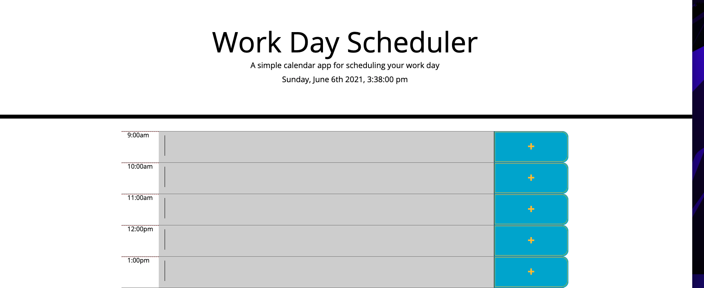

# Work Day Scheduler Starter Code
This work day scheduler is composed of two sections. 
The first section displays the title and the current day and hour.

The section below, has nine different time blocks for the hours 
9 am to 5 pm in a work day. Each row is labeled with its respective 
hour and has its own text area along with a save button on the end. 
Each time block is color coded to signify whether the hour has passed,
is present or is in the future still. 

When the user types something in the area and presses the save button,
that information is saved to local storage. Was not able to display that 
information when page refreshes and pull it from local storage. 

Screenshots: 
 "Top half")
 "Bottom half")

Repo Link: https://github.com/algmoreno/daytime
Live Link: https://algmoreno.github.io/daytime/ 
